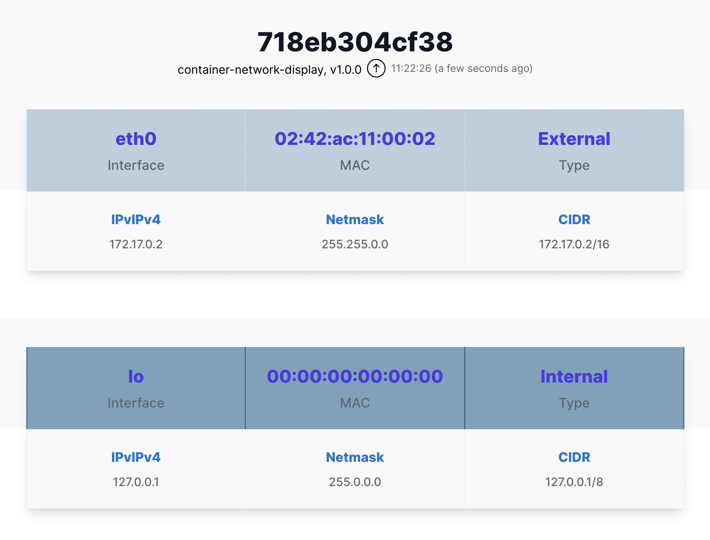

# Container Network Display

Simple container that displays

- hostname
- node.js process uptime
- application name and version number taken from package.json
- network information (interfaces, IP addresses, ...)

This application is intended to be used to showcase container behaviour once started 
on Docker/Podman and Kubernetes. 

## Example
